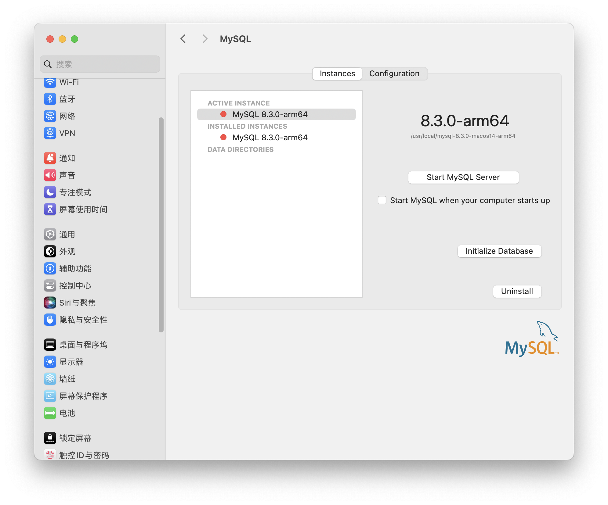
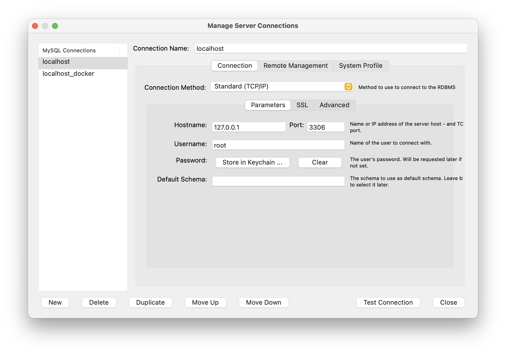
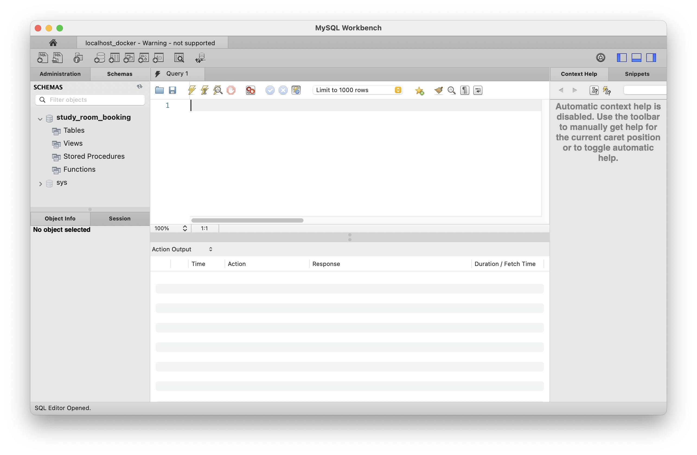
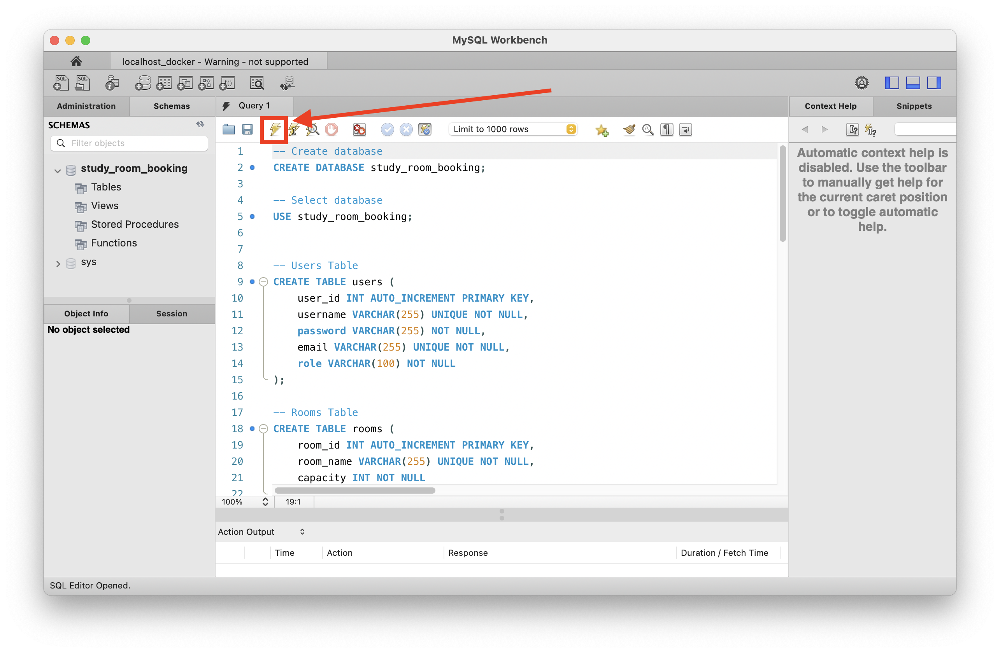
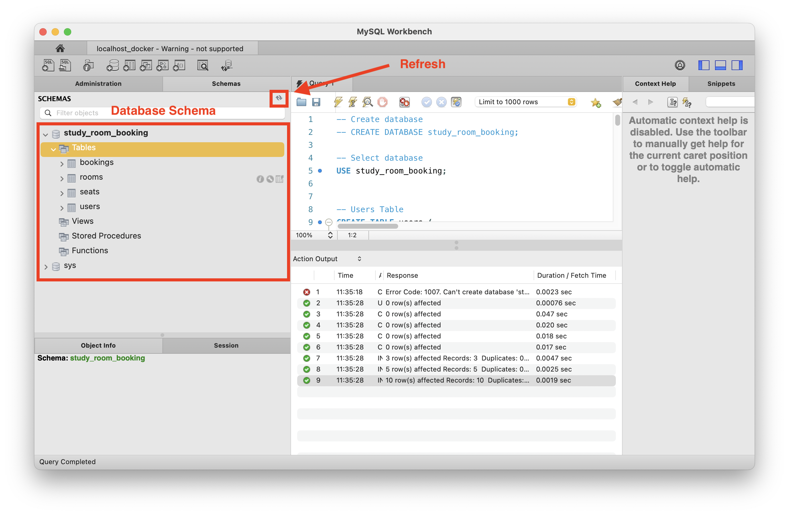

# MySQL Setup

Here is a quick document on how to setup MySQL.

## Standard
Download and install [MySQL Community Server](https://dev.mysql.com/downloads/mysql/). Make sure it is running after installation.

Then download [MySQL Workbench](https://www.mysql.com/products/workbench/) and create a connection.

Connecting should give you this interface.

Copy paste contents of ../database/schema.sql into the page and hit the "run" button.

Click refresh and view the tables on the left.

Our database is now set up!

## With Docker
TODO...